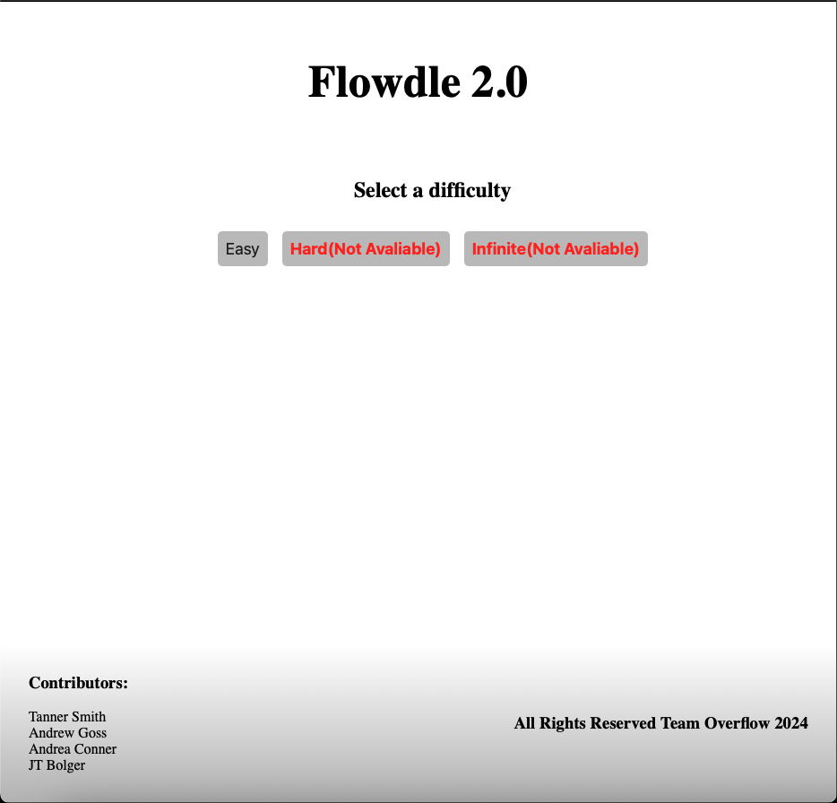
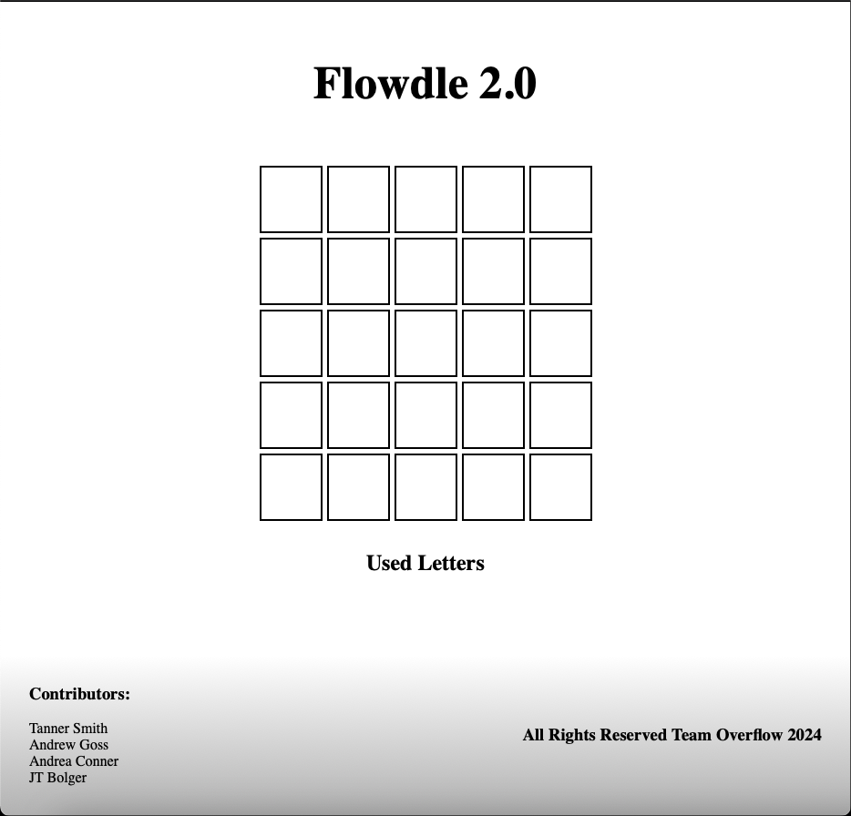
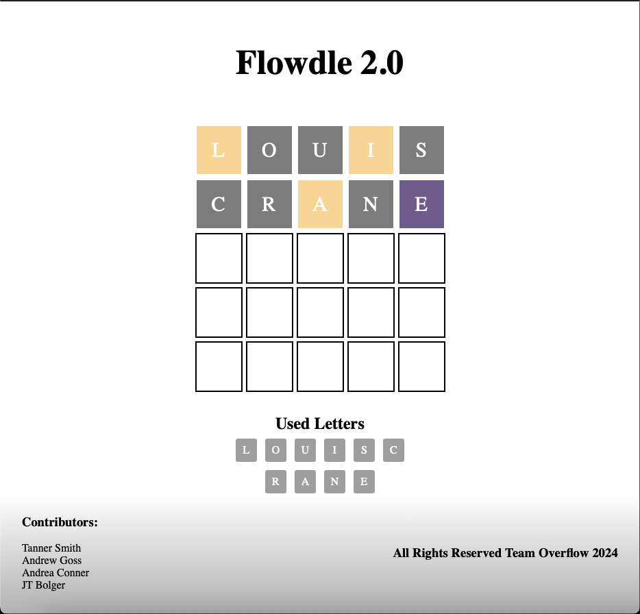
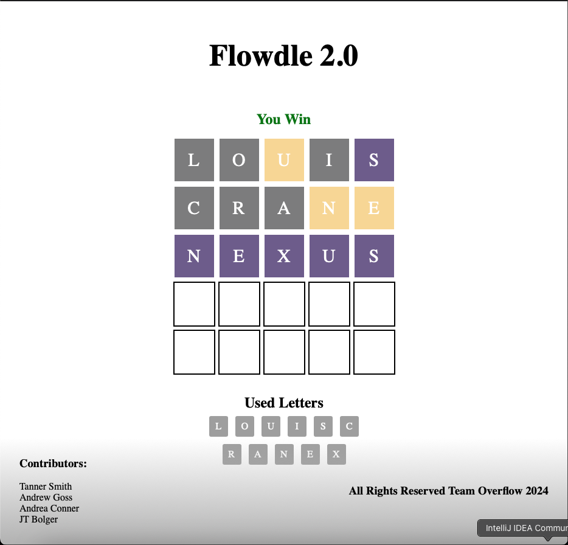
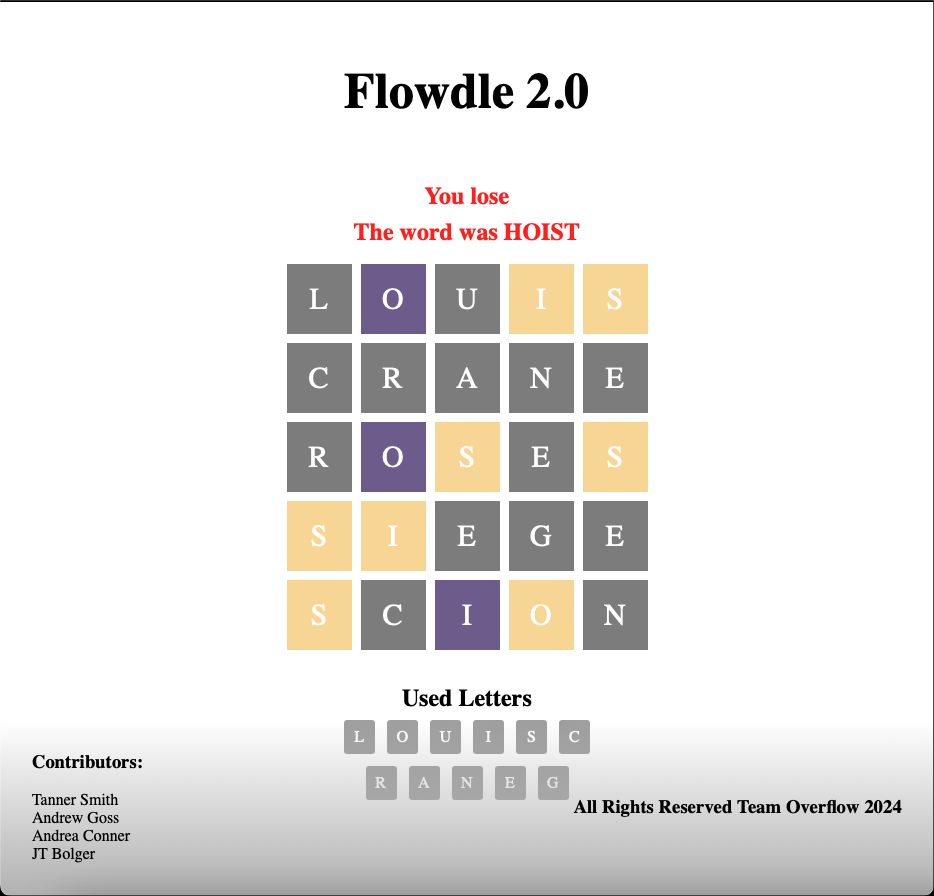

# OverflowProject
> a simple Wordle remake
## Project Overview
Flowdle 2.0 is a simple remake of the popular New York Times game Wordle. It utilizes HTML, CSS, and JavaScript to bring a simple word guessing game to users that is not limited to one word per day.
## How it works
Users are first presented with difficulty buttons to choose from, Easy, Hard, and Infinite (currently only Easy mode is implemented).
 

The user will then be presented with the board, which they can type on the keyboard to provide input to.
 

When the user inputs a guess for the word, the board will show you what letters you have correct, but are in the wrong spot, and letters that are in the correct spot. It will also show you a list of letters you have previously tried.
 

When the user guesses the word correctly, they will be presented with a 'Win' message.
 

When the user does not guess the word in the five guesses, they will be presented with a 'Lose' message.
 

If the user wishes to play again, they just need to reload the page.
## Contributors
Tanner Smith, Andrew Goss, Andrea Conner, JT Bolger